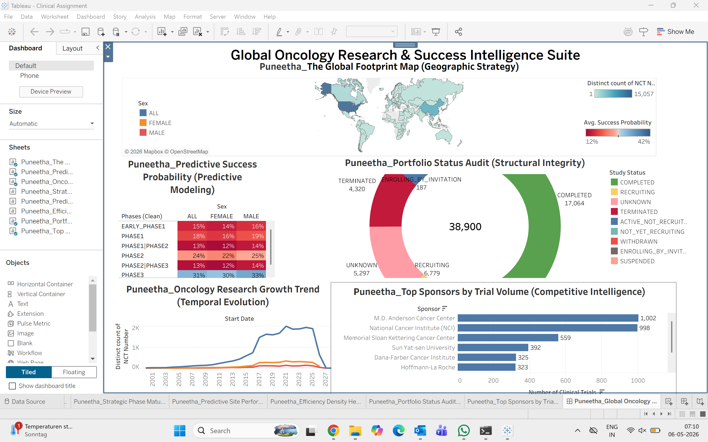
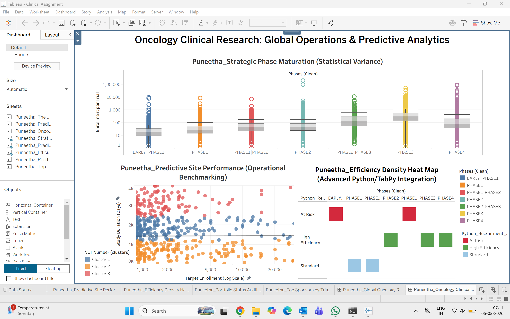

# Predictive Intelligence Framework for Global Oncology Recruitment Risk

## 📌 Project Overview
This project addresses the systemic operational inefficiencies in global oncology clinical trials—specifically targeting the "Recruitment Chasm," where approximately 80% of trials fail to meet mandated enrollment timelines. By blending data engineering, predictive modeling, and live business intelligence architectures, this framework converts raw clinical trial data into a proactive decision-support tool for portfolio optimization.

## 📁 Repository Structure
- `📁 notebooks/`: Contains the Jupyter notebook mapping data preprocessing and Logistic Regression execution.
- `📁 reports/`: Core data sheets and advanced longitudinal capacity audits.
- `📁 images/`: Explanatory visual artifacts and interactive dashboard screenshots.

---

## 🛠️ Technical Architecture & Methodology

### 1. Data Engineering (Tableau Prep Builder)
- **Anomaly Mitigation:** Filtered records to mathematically invalidate placeholder date artifacts (e.g., `1900-01-01`).
- **Feature Engineering:** Extracted a baseline velocity metric: `Trial Duration (Days)`.
- **Data Harmonization:** Unified regional naming variations into a clean, global `Phases (Clean)` dimension.

### 2. Machine Learning Pipeline (Python & Scikit-Learn)
Using a dataset of over 38,000 global oncology trial records, a **Logistic Regression** model was trained within a Jupyter environment to extract predictive weights for trial completion variables based on Phase, Sex, and Target Enrollment.
- **Key Empirical Finding:** Phase 3 maturation serves as the critical success anchor, yielding a baseline predictive completion probability of **31%**.

### 3. Live Analytics Engine Integration (TabPy Server)
The Python-derived coefficients were dynamicized by embedding a custom Sigmoid function calculation directly inside the BI ecosystem. Using **TabPy**, a live patient-per-day volume normalization script runs against real-time filtered dashboard data to categorize operational risks on the fly. 
- **Impact:** The engine successfully isolated **825 high-risk trials** requiring immediate tactical recruitment interventions.

---

## 📊 Visual Intelligence Suite

### Executive Strategic Command Suite
Designed for clinical trial sponsors and C-suite metrics tracking, merging geographic concentration mapping with model-driven predictive matrices.
*Master Filter Visualizations:*
- **Global Footprint Map:** Tracks study density across borders.
- **Predictive Success Heatmap:** Visualizes the gender-based completion probabilities across development phases.
- **Portfolio Status Donut Audit:** Centers an anchor profile count of 38,900 trials for rapid diagnostic health checks.

| Executive Dashboard Preview | Operational Deep-Dive |
| :---: | :---: |
|  |  |

### Cross-System Statistical Audits (Advanced Excel Combo Analysis)
To complement the predictive layers, a longitudinal supply-and-demand combo analysis was modeled. By charting historical trial volume lines over average enrollment bars, a clear capacity gap was flagged: Phase 3 trials demonstrate maximum enrollment demand, yet trial volume significantly declines from Phase 2, highlighting an investment barrier.
